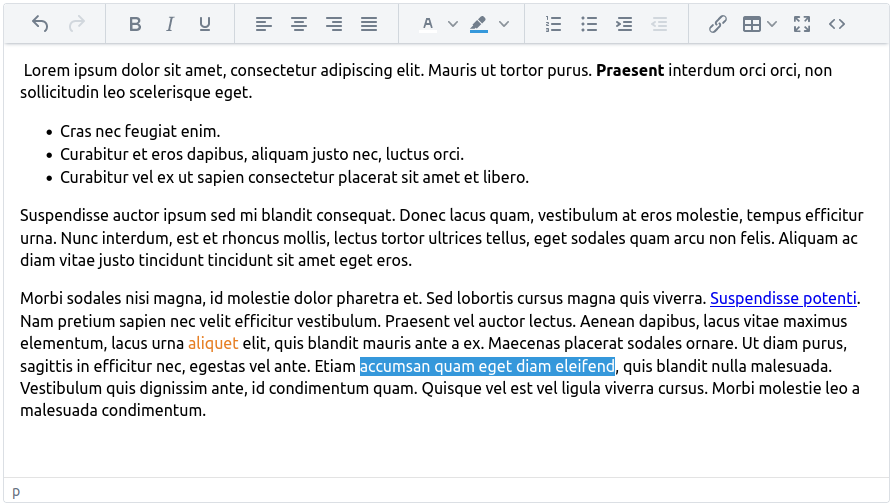

[](http://www.apache.org/licenses/LICENSE-2.0)

# Jmix TinyMCE Editor 

This add-on provides support for [TinyMCE WYSIWYG Editor](https://www.tiny.cloud/) through the [TinyMCE wrapper for Vaadin Flow](https://vaadin.com/directory/component/tinymce-for-flow) addon.



> [!NOTE]  
> Only non-paid plugins are supported

## Installation

The following table shows which version of the add-on is compatible with which version of the platform:

| Jmix Version | Add-on Version | Implementation                                  |
|--------------|----------------|-------------------------------------------------|
| 2.2.1        | 1.0.0          | gr.netmechanics.jmix:jmix-tinymce-starter:1.0.0 |

Add to your project's `build.gradle` dependencies:

```gradle
implementation 'gr.netmechanics.jmix:jmix-tinymce-starter:1.0.0'
```

## How to use the add-on

In an edit screen you can add the field from studio `Component Palette` window


or through code

```xml
<window xmlns="http://jmix.io/schema/ui/window"
        xmlns:nm="http://schemas.netmechanics.gr/jmix/ui"
        focusComponent="form">
    ...
    <layout>
        <formLayout id="form">
            <nm:tinyMceEditor id="summaryField" property="summary" />
        </formLayout>
        ...
    </layout>
</window>
```

## Configuration

We can configure the editor, based on predefined configuration modes, provide custom configuration or combine the two.

> [!TIP]  
> If no other configuration is specified, the _BASIC_ configuration mode is used.

### Configuration Modes
There are two configuration modes, BASIC and ADVANCED. Both modes have no menubar, but a single toolbar with buttons:

**BASIC**

```xml
<nm:tinyMceEditor id="summaryField" property="summary" 
                  configMode="BASIC" />
```

BOLD, ITALIC, UNDERLINE, ALIGN_LEFT, ALIGN_CENTER, ALIGN_RIGHT, ALIGN_JUSTIFY, FORECOLOR, BACKCOLOR, NUMBERS_LIST, BULLETS_LIST, INDENT, OUTDENT, LINK, TABLE, FULLSCREEN, CODE


**ADVANCED**

```xml
<nm:tinyMceEditor id="summaryField" property="summary" 
                  configMode="ADVANCED" />
```

UNDO, REDO, CUT, COPY, PASTE, PASTE_TEXT, BOLD, ITALIC, UNDERLINE, SUBSCRIPT, SUPERSCRIPT, ALIGN_LEFT, ALIGN_CENTER, ALIGN_RIGHT, ALIGN_JUSTIFY, FORECOLOR, BACKCOLOR, NUMBERS_LIST, BULLETS_LIST, INDENT, OUTDENT, LINK, UNLINK, TABLE, MEDIA, HR, CHARACTER_MAP, VISUAL_BLOCKS, REMOVE_FORMAT, FULLSCREEN, CODE


### Custom Configuration

We can provide our own configuration per editor. We can config the menubar and the toolbar(s), using the appropriate enums. In  the toolbar, we can use the pipe (|) character to group buttons, and the plus (+) character to add a new toolbar.

```xml
<nm:tinyMceEditor id="summaryField" property="summary" 
                  menubar="FILE INSERT" 
                  toolbar="TABLE | UNDO REDO + ALIGN_LEFT ALIGN_CENTER ALIGN_RIGHT ALIGN_JUSTIFY"/>
```


### Combined Configuration

We can combine any of the configuration modes with custom menubar and toolbar(s) configuration.

```xml
<nm:tinyMceEditor id="summaryField" property="summary" 
                  configMode="BASIC" 
                  toolbar="UNLINK MEDIA"/>
```


